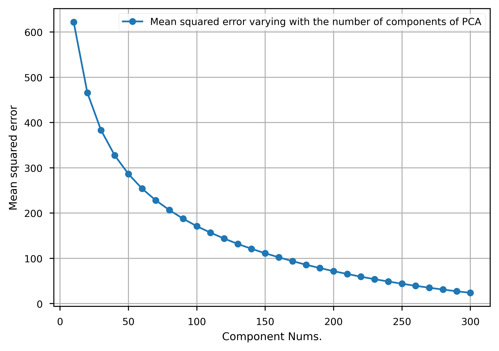
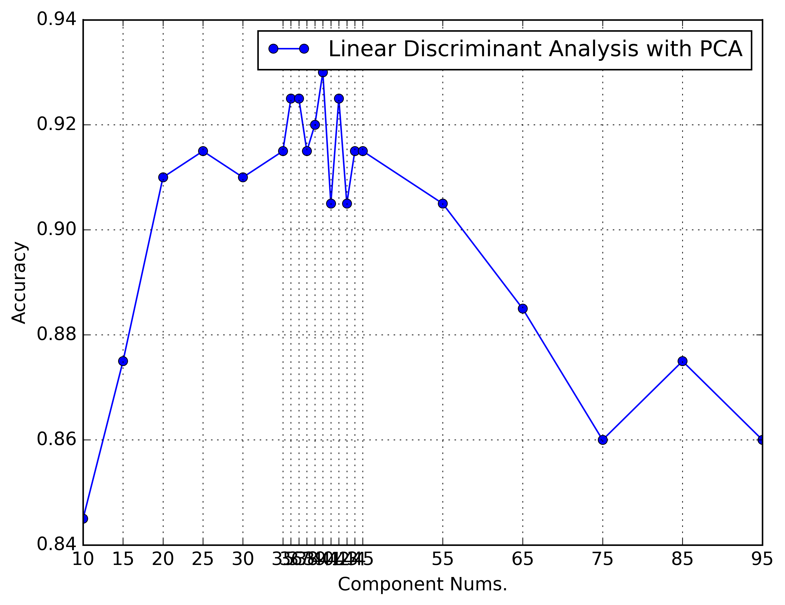
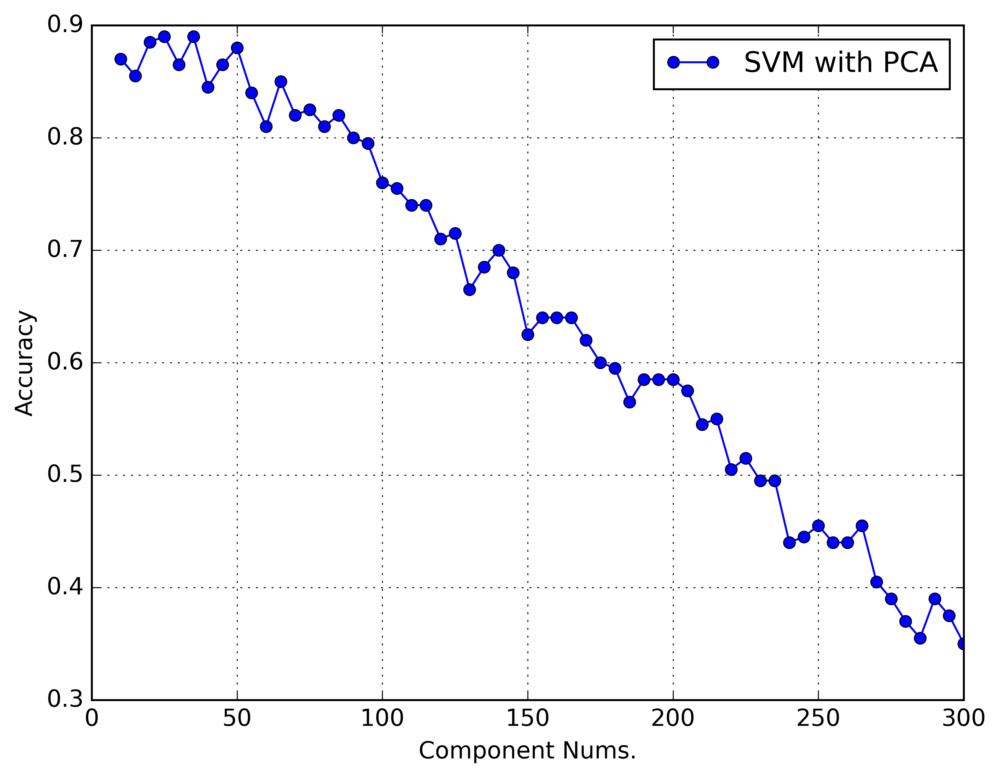

# 练习题

## 如何复现
现在的结果已经全部在./results文件夹中，如果需要复现结果可以将该文件夹中

复现习题一的所有结果，运行代码
`cd code && python practice_1.py`

复现习题二的所有结果，运行代码
`cd code && python practice_2.py`

复现习题三的所有结果，运行代码
`cd code && python practice_3.py`

## 习题一
### Kmeans
用不同的随机数和超参，跑了100轮KMeans。

详细结果见"./results/practice_1_kmeans_detail.txt", 
包涵初始类中心点；迭代次数；聚类结果（每类包含的样本，类中心）；错误率。

实验结果汇总见"./results/practice_1_kmeans_summary.txt"。
目前最好的超参为迭代9次，平均ACC0.890，最优ACC0.893.

### 谱聚类
结果放在"./results/practice_1_spectral_cluster_detail.txt"
最优ACC可以打到0.9

## 习题二
### 最近邻分类
结果如图，详细结果放在"./results/practice_2_nearest_neighbors_classifier_detail_results.txt"

### PCA降维损失
结果如图，随着COMPONENTS数目的增多，复原图片之后的损失变得越来越小。

### Eigenface+Fisherface(ACC最高)
结果如图，详细结果放在"./results/practice_2_pca_lda_detail_results.txt"。

我们可以看到并不是COMPONENTS数目越多越好，但COMPONENTS=N_C时，分类效果最好。此时ACC=0.93

### Eigenface+SVM
结果如图，详细结果放在"./results/practice_2_pca_svm_detail_results.txt"。

和LDA一样，并不是COMPONENTS数目越多越好，但COMPONENTS=N_C时，分类效果最好。此时ACC=0.93
